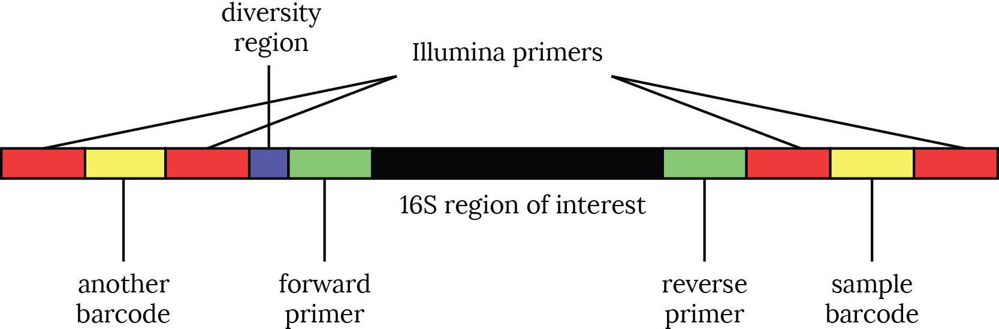

# Where 16S data comes from

## What is 16S data?

By "16S data" I mean metagenomic amplicon sequencing of some section of the
bacterial 16S rRNA gene.

The use of the term "metagenomic" in this context may be confusing, since
"metagenomics" is often used interchangeably with "shotgun whole-genome
metagenomic sequencing". Technically, "metagenomic" means "related to more than
one genome", that is, sampling from an entire community rather than from a
single cell or a single colony. Both 16S sequencing and whole-genome shotgun
sequencing intend to sample from many bacterial species in the sample, so they
are both technically metagenomic.

It is also worth noting that, while amplicon sequencing in theory provides
strictly less information that shotgun sequencing ---since it examines only a
part of bacteria's genomes rather the entire genomes--- amplicon-based
approaches have three key advantages.

First, shotgun sequencing projects tend to be more expensive, since they need
to sequence deeper to get the same information about microbial community
composition. In theory, if you shotgun sequence at a great enough sequencing
depth, you could reconstruct all the information that you could get
from 16S amplicon sequencing, but this can be an expensive proposition.

Second, because only bacteria and archaea have the 16S gene,[^chloro] a tube of 16S
amplicon DNA mostly carries information about microbes. In contrast, the
majority of shotgun reads from, say, a swab of human skin will be human DNA.
Amplicon sequencing may be some help in terms of privacy, since research
subjects are likely more comfortable with their microbes' DNA being sequenced
rather than their own human DNA. Furthermore, if you are interested in only
microbes, using amplicon sequencing means that you are not spending any of your
DNA sequencing budget on sequencing human DNA that is unimportant to your
research question.

[^chloro]: Chloroplasts, found in algae and other eukaryotes, have a ribosomal
  gene that is very similar to 16S and often ends up getting amplified in 16S
data sets.

Finally, amplicon sequence data is substantially easier to work with from a
bioinformatic point of view. Shotgun sequences need to be *assembled* to recreate
the genome sequence, which is computationally and conceptually demanding. By
contrast, 16S sequencing data provides information from just one part of the
genome, and each read is likely to cover the entire area of interest.

## The 16S gene

All bacteria and archaea have at least one copy of the 16S gene in
their genome.[^kembel] The gene has some sections that are *conserved*, meaning
that they are very similar across all bacteria, and some sections that are
*variable* (or "hypervariable"). The idea behind 16S sequencing is that the variable regions are not
under strong evolutionary pressure, so random mutations accumulate there.
Closely-related bacteria will have more similar variable regions than
distantly-related bacteria.

[^kembel]: It's not unusual for bacteria to have multiple copies of the 16S gene, and those copies might not be identical to one another. Some people are concerned by the effect this could have on interpretations of 16S data (e.g., [Kembel *et al*.](http://dx.doi.org/10.1371/journal.pcbi.1002743) [doi:10.1371/journal.pcbi.1002743] and [Case *et al.*](http://dx.doi.org/10.1128/AEM.01177-06) [doi:10.1128/AEM.01177-06]).

## Getting DNA from a sample

After a sample is taken, the cells in the sample are lysed, typically using some combination of chemical membrane-dissolving and physical membrane-busting. The DNA in the sample is then *extracted*, meaning that all the protein, lipids, and other stuff in the sample is thrown away. From this pile of DNA spaghetti, we aim to collect information about the bacteria that were in the original sample.

## Amplifying the gene

In the amplicon sequencing approach, polymerase chain reaction (PCR) is used to
amplify a section of the 16S gene. The size of the sequenced section is limited
by the length of reads produced by high-throughput sequencing. The sections of
the 16S gene that are amplified are named according to what variable regions of
the gene are covered.

Of the nine variable regions, named V1 through V9, the
region most commonly used in the microbiome literature is V4.
However, different regions can provide different taxonomically resolution for different
parts of the microbial tree of life. V4 is popular because it provides good
taxonomic resolution for gut microbiota. By contrast, the an amplicon covering
the first two regions (V1-V2) is more common in studies of the skin microbiome
because those regions provide better taxonomic resolution for the microbes
commonly found on the skin.

PCR reactions on these regions have primers that match the constant regions
around the targeted variable regions. Papers should always say which primers
they used, and they usually also mention the amplified region. The primers have
names like 8F (i.e., a forward primer starting at nucleotide 8 in the gene)
and 1492R (i.e., a reverse primer starting at nucleotide 1492).

## The amplified DNA is not exactly like the original DNA

The process of extracting DNA from bacterial cells and then amplifying a 16S
region introduces certain biases into the resulting sequence data. These
effects mean that observed differences in bacterial community composition *between*
samples collected in a single study are usually more reliable than apparent
differences in composition *within* sample. In other words, 16S data are better
able to support a statement like "species *X* is more common in patient cohort
*A* than in to cohort *B*" rather than a statement like "species *X* is more
abundant than species *Y*".

These biases also means that large effects, like variations over orders of
magnitude, are to be trusted far more than smaller changes.

### Extraction bias

Different cells respond differently to different extraction protocols.
Using different extraction protocols on the same sample can
produce markedly different results.[^extract]
My takeaway is that, if you're comparing two different data sets, it's important to know
if they used the same extraction methodology, since differences in the 16S
data could be due to differences in the microbes or due to differences in the methods
used to extract the DNA.

[^extract]: E.g., [Salter *et al.*](http://dx.doi.org/10.1186/s12915-014-0087-z) (doi:10.1186/s12915-014-0087-z), [Walker *et al.*](http://dx.doi.org/10.1371/journal.pone.0088982) (doi:10.1371/journal.pone.0088982), [Rochelle *et al.*](http://dx.doi.org/10.1016/0378-1097(92)90188-T) (doi:10.1016/0378-1097(92)90188-T), etc. But compare [Rubin *et al.*](http://dx.doi.org/10.1002/mbo3.216) (doi:10.1002/mbo3.216).

### PCR bias

Although we say the PCR
primers bind a "conserved" region, there is still variation in those regions.
Thus, some bacteria in the sample will have
different nucleotides at the primer binding site, meaning that the PCR primers will bind with
different affinities to the DNA of different bacteria. This effect decreases
the number of reads from bacteria whose constant regions don't match
the primer.[^2]

"PCR bias" encompasses other things beyond primer site binding bias.
It's known that PCR has different efficiencies for different types of
sequences, meaning that some 16S variable regions will amplify better than
others. Also, statistical fluctuations can occur, especially in low-diversity
samples. This means that a sequence that, by chance, gets lots of amplification
in early PCR cycles could dominate the sample in late PCR cycles.

[^2]: It may be that there are a lot of interesting bugs whose 16S sequences are so divergent that they don't match the typical primers (cf. [Brown *et al.*](http://dx.doi.org/10.1038/nature14486); doi:10.1038/nature14486).

In general, PCR bias is more pronounced when the density of bacteria in the
original sample is low, such that the PCR needs to be run for more cycles. For
example, samples of human stool, in which the density of bacteria is enormous,
are experimentally less finicky than skin swabs, which typically have very
lower bacterial concentrations.

### Chimeras

PCR also creates weird artifacts called *chimeras*. When using PCR to amplify
two DNA sequences *a* and *b*, you'll get many copies of *a*, many copies of *b*, and some
sequences that have an *a* head and *b* tail (or vice versa). If that chimeric
*a*-*b* sequence looks like a real bacterial sequence, it can confuse downstream
analyses.

### Lab-, study-, and batch-specific effects

There are also biases that arise from *any* DNA-based experiment, like the
biases that result from the method of collection or storage. There are many
studies exploring how storage at different temperatures, storage for different
lengths of time, different storage buffers, and so forth affect the measured bacterial
community compositions. Regardless of what method of collection and storage is
used, using the same methodology for every sample in a study is a crucial tool for reducing
biases in the data.

## Multiplexing

Next-generation sequencing became more helpful to microbial ecology when
*sample multiplexing* (or "barcoding") was worked out in the early
2000s.[^multi] Before multiplexing, every sample had to be run on its own
sequencing lane. This was expensive and bioinformatically annoying, since,
especially in those early days of sequencing, it was often hard to distinguish
a bad lane from a very unusual sample.

[^multi]: Cf., e.g., Binladen *et al.* (doi:10.1371/journal.pone.0000197).

Multiplexing, by contrast, adds a *barcode* (or "tag") to the 16S amplicon. Each
barcode corresponds to a sample, and all amplicons in that sample get that
barcode. It's now common to multiplex 96 (or 384) samples and sequence them all in
one lane.

Aside from making the sequencing 96-fold cheaper, multiplexing means that it's
easier to include some controls in each lane. Negative controls usually just
vehicle with no DNA as a way to check for contamination from reagents or poor
sample preparation. Positive controls typically take the form of mock
communities of known composition, which can be used to check that the
sequencing was not "weird". If you have a lot of samples from the same project
and you need to run them in more than one lane, you can use the positive
controls as an internal check that sequencing proceeded similarly across lanes.

## Sequencing

A little more work has to be done before putting the sample in the sequencer.
These steps will depend on the sequencing platform. Here I'll talk about
Illumina because it's popular[^roche] and I have experience with it. If you're using
a different sequencing platform, like Nanopore, then you'll need to learn about the quirks
of that platform elsewhere.

[^roche]: It wasn't that long ago that 454 (or "Roche") sequencing led the next-generation field. Plenty of papers used "pyrosequencing" (the technical word for 454's sequencing methodology) as a synonym for "next-generation sequencing".

Samples to be sequenced on an Illumina machine need to have Illumina-specific
*adapters* added in a third PCR (one for amplification, one to add the barcodes,
and one to add the adapters). These adapters allow the DNA amplicons to bind
the flowcell, where they are sequenced.

It is sometimes also desirable to have a
*diversity region* added between the adapter and the 16S primer. The Illumina
sequencers expect to see a diversity of nucleotides at every read position. In
amplicon sequencing, almost all the reads are the same through the primer
region, which can cause difficulties for the sequencer.

All of these pieces ---the 16S region you're interested in, forward and reverse
primers, barcodes, diversity region, and Illumina adapters--- are all made into
a single *PCR construct*, which is a single piece of DNA. The sequencer reads
the nucleotides in the construct and uses its knowledge about the arrangement of
the construct to infer which nucleotides are the region of interest and which
are the barcode.

