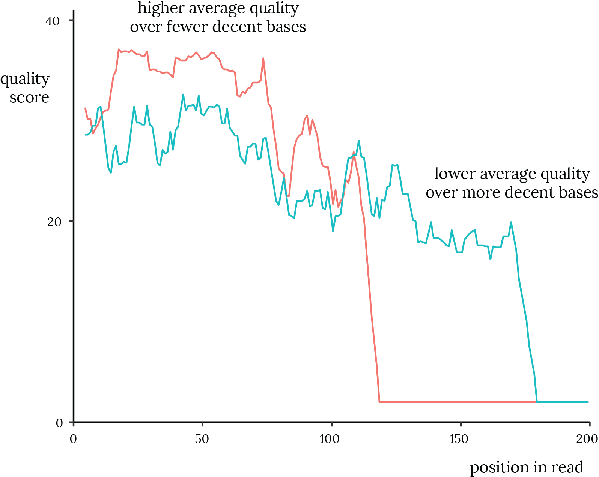
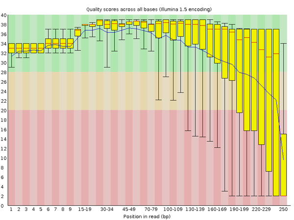

# Data processing theory

Hooray, you have sequence data! Now what? I'll assume you did paired-end sequencing (but I'll make a note for those of you who didn't). Notably, all 454 sequencing is single-ended.

## Raw data and metadata

### Expected raw data files

Before trying to process your dataset, be sure you have the appropriate raw data[^raw_data] and metadata.
In all cases, this means you'll need one set of reads.
For Illumina, this means a *fastq* file that might have a name like:

    130423Alm_D13-1939_1_sequence.fastq

This filename is typical for raw sequencing data: it has information about the date (2013-04-23), the
group that requested the sequencing (Alm Lab), then something about the specifics of the sequencing
run. The `_1_` indicates that these were forward reads. (Forward read files might have `_R1_`
in place of `_1_` in the filename.)

[^raw_data]: In what follows, I'll talk about "raw data", by which I mean data that you would get from the sequencing center. There is actually a more raw kind of data that comes right out of the sequencing machine that gets processed right away. On the Illumina platform, this data is CASAVA. Different version of CASAVA produce slightly different output, and every sequencer might have a different version of CASAVA, so be prepared for slight variations in the format of your raw data.

If you did paired-end sequencing, you will also need the *reverse reads*.
This is a fastq file with a
name like the forward reads except with `_2_` or `_R2_` in it.
Every entry in the reverse reads should match an entry in the forward reads. In
most cases, the two pairs of a read appear in analogous places in the two files
(i.e., the forward read entry starting on line *x* in the forward read file
corresponds to the reverse read starting on line *x* in the reverse reads file).

### Demultiplexing

It is now standard practice for delivered to you to have already been split
into samples (or *demultiplexed*). This means your (forward, or reverse) reads
are not in one big file, they are in multiple files, each named (or in a subfolder
that is named) that indicates that those are reads belonging to a certain sample.

If you data are not demultiplexed (i.e., you only have one big file of forward
reads), then you will also need the *barcode* or *index reads*. Depending on
your Illumina version, this information might be in different places. In some
datasets, it's in the file with the forward reads. For example, the file I
mentioned above, the first line is

    @MISEQ578:1:1101:15129:1752#CCGACA/1

The barcode read is
`CCGACA` (between the `#` and the `/1`). In other datasets, you might find
the index reads in a file with a name that has `_R3_`, `_I_`, or `_I1_` in
it.

If you have barcodes, you will also need a *barcode map*.
This is the information about what barcode goes with what sample. A common
gotcha in 16S data processing is that the barcode map might have barcodes
that are reverse complements of what are in the samples.

### Primer sequences

It is also now standard practice to remove the primer sequences before handing
the data to researchers. If the primers haven't already been removed, you'll
need to remove them yourself, which requires that you know what the foreward
and reverse primer sequences are.

Two of the most common "gotcha's" I experienced as a graduate student when
processing 16S data had to do with primers: (i) I thought the primers had been
pre-removed when they were actually still present and (ii) I thought I had the
sequences of the primers but I actually had the reverse complements of those
primers.

### Summary of expected files

Overall, you will likely need:

- Demultiplexed forward reads, with one file per sample
- Demultiplexed reverse reads, with one file per sample

However, depending on how the data were delivered to you, you might also
need:

- Barcode reads
- Barcode map
- Primer sequences

In general, it's very useful to ask for or search for
this entire list of things when you're starting to analyze a data set from
scratch.

If you download a dataset or get it from a collaborator, it might come in an
already-processed format. Depending on your purposes, it might be fine to use
that data, which will look similar to something we'll get a little further down
this pipeline. It's useful to know exactly what the content of the data is before
you start working on it. If it lacks any of these parts, make sure to find
them before you try to get to work!

## Overview of the processing pipeline

16S data analysis breaks down into a few steps:

### Phase I: Preprocessing

This initial step is mostly about getting the data organized. This is where you
confirm that the data are in the format that you expect, and you make any
tweaks you want to before moving on into processing proper. There are two
processing steps, already mentioned above, that now commonly happen before you
as a researcher will even see the data. In fact, these steps are now so routine
that they are rarely reported as part of the methods in research papers. However,
there is still a nonzero amount of decision-making that goes into how these steps
are done, so I include them in this Phase I.

- *Demultiplexing* (or "splitting"). The man-made barcode sequences are
  replaced by the names of the samples the sequences came from.
- *Removing* (or "trimming") *primers*. The primers are a man-made thing. If
  there was a mismatch between the primer and the DNA of interest, you'll only
  see the primer. In this sense, the primer sequence masks the true biological
  content of the DNA of interest. Removing the primers is conservative in the
  sense that you won't come to any false conclusions about the content of the
  DNA of interest, but the cost is that, for the most part, the primer
  sequences matched the biological DNA pretty well. Regardless of the tradeoff,
  common practice is to cut off the primers.

### Phase II: Cleaning

These steps take the raw data and turn it into biologically relevant stuff.
There is some freedom about the order in which they can be done. I separate
these steps out from preprocessing because the choices you make here can
substantially affect your data.

- *Quality filter* (or "trim") reads. For every nucleotide in every read, the
  sequencer gives some indication of its assuredness that that base is in fact
  the base the sequencer reported. This assuredness is called *quality*: if a
  base has high quality, you can be sure that that base was called correctly.
  If it has low quality, you should be more skeptical. In general, reads tend
  to decrease in quality as they extend, meaning that we get less sure that the
  sequence is correct the further away from the primer we go. Some reads also
  have overall low quality.[^4] Quality filtering removes sequences or parts of
  sequences that we think we cannot trust.
- *Merging* (or "overlapping" or "assembling" or "stitching") read pairs. When
  doing paired-end sequencing, it's desirable for the two reads in the pair to
  overlap in the middle. This produces a single full-length read whose quality
  in the middle positions is hopefully greater than the quality of either of
  the two reads that produced it. There's no such thing as "merging" for
  single-end sequencing.

[^4]: Annoyingly, it's my experience that the first reads in the raw data are
  substantially worse than most of the reads in the file. In the dataset I'm
  looking at, the first 3,000 or so reads (of 13.5 million total) have an
  average quality that is about half of what's typical for that dataset. This
  means that, if you want to check the quality of the sequences in a dataset,
  you can't just look at the first few entries, you need to go some ways down
  into the file.

### Phase III: Denoising

Denoising is the process of accounting for errors inherent in sequencing
technology, especially the Illumina platform. In short, denoising "corrects"
sequencing error, decreasing the diversity of sequences in the data that are
due to technological error rather than to true biological diversity.
Two important implementations of
denoising are [DATA2](http://dx.doi.org/10.1038/nmeth.3869) and
[Deblur](http://dx.doi.org/10.1128/mSystems.00191-16).

The work of denoising
was previously done as a part of operational taxonomic unit (OTU) calling.
Denoising and OTU calling are sufficiently conceptually complex and
historically intertwined that I will discuss them separately in the next
chapter.

This step implicitly includes two other steps that were traditionally treated separately:

- *Dereplicating*. There are fewer *sequences* (strings of `ACGT`) than there
  are *reads*. This step identifies the set of unique sequences, which is
  usually much smaller than the number of reads.
- *Proveniencing* (or "mapping" or "indexing"). How many reads of each sequence
  were in each sample? (Only I call it "proveniencing"[^3]. I find all the
  other names I've heard confusing.)

[^3]: In archaeology, an artifact's _provenience_ is the place within the
  archaeological site where it was found.

### Phase IV: OTU calling

As mentioned above, calling (or "picking") operational taxonomic units (OTUs)
is a conceptually and historically complex topic, so I will treat it in a
separate chapter. In short, OTU calling (or "picking") assigns every
dereplicated sequence to a group, or OTU. You can combine the sequence-to-OTU
information from OTU calling with the sequence-to-sample-counts information
from proveniencing to make an OTU table that shows how reads mapping to each
OTU appear in each sample.

### Phase V: Analysis

The part where you actually use your data! This part is outside the scope of this work.
I do, however, encourage you to use the same intellectual attitude that's promulgated
here: don't just use an analytical tool because it's popular or because someone else
used it.

## Details of each step

### Removing primers

In an ideal world, this is straightforward: you find the piece of your
read that matches the primer, and you pop it off.
In practice, there are two important considerations:

- *Where do you look for the primer?* Does the primer start at the very first
nucleotide of the read, or a little further in? You can put a lot of flexibility
in this step without a lot of negative effects, but it's good to know what's
going on in your data.
- *What does "match" mean?* How many mismatched nucleotides do you allow between the
read and your primer sequence before you consider the read "bad"? In practice,
it's common to only keep reads that have at most one error in the primer match.

### Merging

Merging is the most complex part of the pre-OTU-calling steps. Merging requires you to:

- *Find the "best" position for merging.* If you were sure all your amplicons are
exactly the same size, then this is trivial: just overlap them at the right length.
However, even in amplicon sequencing, there are
insertions and deletions in the 16S variable regions, so we can't be sure that
all merged reads will be the exactly the same length.
- *Decide if the "best" position is good enough.* If you have two reads that don't
overlap at all, should you even include it in the downstream analysis?[^5] How
good is good enough?
- *Compute the quality of the nucleotides in the merged read using the qualities in
the original reads.* This requires some basic Bayesian statistics. It's not
super-hard, but it was hard enough to be the subject of (among others) a [2010
Alm Lab paper](http://dx.doi.org/10.1371/journal.pone.0011840) and a [2015
paper](http://dx.doi.org/10.1093/bioinformatics/btv401) from the maker of
`usearch`.

[^5]: If you had two paired-end reads that didn't overlap but you were somehow sure of the final amplicon size, then you could insert a bunch of `N`'s in between. This is an advanced and specialized topic.

### Quality filter

Sequences tend to vary in overall quality (some good, some bad)
and the number of bases they have that are good. Inherent in the Illumina technology is
a trend for sequences to decrease in quality as you move down the sequence.

The sequencer will give you a sort of quality report about your sequences' average
quality. It will give you a sense of whether your sequencing run as a whole was
good, and it will give you a sense of whether you got the sort of good-quality
length you were hoping for.

The big quality report gives you a sense of whether you should do the whole
sequencing run over again. Even in a good sequencing run there are bad sequences
that should be filtered out. There are two common ways to quality filter:

- *Quality trimming* means truncating your reads at some nucleotide after which the sequence
is "bad".[^othertrim] A common approach is to truncate everything after the first
nucleotides whose quality falls below some threshold.
- *Global quality filtering* means discarding an entire read if the average quality
of the read is too low. Maybe no individual nucleotide falls below your trim
threshold, but the general poor quality of the read means that you'd rather not
include it in analysis. This criterion is expressed equivalently as "average
quality" or "expected number of errors".[^flyv] When I work with 250 bp amplicons,
I like to throw out reads that have more than two expected errors.

[^othertrim]: Confusingly, "trimming" also refers to a different process when, if you're doing unpaired amplicon sequencing, you pick a length, discard all reads shorter than that, and truncate all the longer sequences at that length. It is essential to do this when using certain *de novo* OTU calling methods, and it's probably beneficial to do with reference-based OTU calling and or taxonomy assignment methods.

[^flyv]: There's a nice paper by [Edgar & Flyvbjerg](http://dx.doi.org/10.1093/bioinformatics/btv401) (doi:10.1093/bioinformatics/btv401) that shows how to compute this.

I like to merge then global quality filter. Other people quality trim then merge.
I think it makes more sense to see merge, see what the resulting qualities
look like, and make a decision based on that (rather than decide what you think
would make a good merged product before you even do the merge).

### Demultiplexing

This step is similar to primer removal:

- *Which of the known barcodes is the best match for this barcode read?* That's a
pretty straightforward answer. (What if there's a tie, you say? Barcodes are
chosen with an [error-correcting code](http://dx.doi.org/10.1038/nmeth.1184)
so that a tie implies that you have at least two errors in the read.)

- *Is the match with the known barcode good enough?* A common approach is,
given a barcode read, to compare that read with all the known barcodes (i.e.,
the barcodes you're looking for). If the known barcode that matches best has
more than one mismatch with the barcode read, call that read "bad" and discard
it.

### Chimera removal (or "slaying")

As mentioned early on, PCR can produce chimeric sequences.[^chimera] Depending
on your choices about OTU calling, you may want to remove chimeras after
dereplicating. Chimera removal checks to see which of your dereplicated sequences
can be made by joining the first part of one sequence (the "head") with the last
part of another sequence (the "tail").

Chimera removal methods come in two main flavors: *reference-based* and *de novo*.
In reference-based methods, you look for the head and tail sequences in some
database. Popular databses include Greengenes, [SILVA](http://www.arb-silva.de/),
the Broad Institute's [ChimeraSlayer](http://microbiomeutil.sourceforge.net/)
(or "Gold") database, and [RDP's "Gold"](https://sourceforge.net/projects/rdp-classifier/files/RDP_Classifier_TrainingData/)
database.

In *de novo* methods, you ask which of your sequences
have could be generated by combining other (typically more abundant) sequences
from that same dataset.
In the past, this was a computationally-expensive undertaking, but there are
ever-improving methods, notably, the [UPARSE](http://dx.doi.org/10.1038/nmeth.2604)
algorithm, which is now `usearch`'s standard way of simultaneously calling
*de novo* OTUs and doing *de novo* chimera detection.

[^chimera]: The Chimera was a monster in Greek mythology. It had the head of a lion and the tail of a snake. It was slain by the hero Bellerophon.
