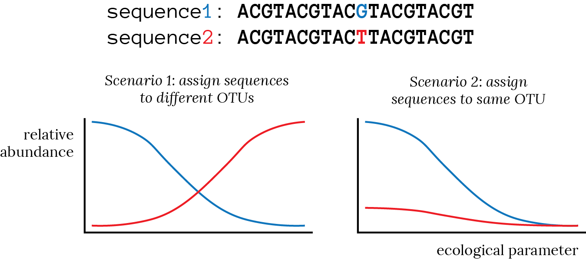

# OTU-calling theory

*Operational taxonomic units* (OTUs) are often the fundamental unit used
in 16S data analysis. In most data processing pipelines, OTUs and their
abundances in the samples are the output.

OTU-calling methods are (to my eyes) surprisingly diverse, and the choice of
method can have a huge impact on the the results of your analysis. Any
OTU-based information, plot, or analysis must be interpreted in the
context of how those OTUs were called.

A pet peeve of mine is when someone asks "how many OTUs" were in some sample.
That number, on its own, means very little. It matters how the OTUs were called.
That question is like asking how many kinds of board games there are. The answer
depends on how you define "kinds".

## An abridged history of the OTU

This is my short and probably incorrect history of the OTU concept.

In the 1980s, Carl Woese showed that the 16S gene could be used as a molecular
clock. Using 16S data, he [re-drew](http://dx.doi.org/10.1073/pnas.87.12.4576)
the tree of life, breaking up the older
Monera[^monera] into Bacteria and Archaea, showing that Eukaryotes and Archaea are closer
cousins than are Archaea and Bacteria. The 16S gene was therefore a promising
practical candidate for distinguishing bacterial *species*.[^known]

[^known]: In 1991, PCR-amplified portions of the 16S gene were used to identify known species. The paper has a prescient final sentence: "While this [i.e., PCR] should not be a routine substitute for growing bacteria, picking individual colonies, and confirming their phenotypic and biochemical identities, it will enable experiments to be performed that were not previously possible." ([Weisburg *et al.*](http://jb.asm.org/content/173/2/697.short), *J Bacteriol* **173** [1991])

[^monera]: I'm shocked that, attending public high school in the early 2000s, we were *still* taught about Monera and Protista rather than about Bacteria, Archaea, and Eukaryota.

The species concept is easy to define for sexual macroorganisms: two
living things of opposite sex are in the same species if they can produce
fertile offspring together. Bacteria don't have sex, but they do perform
homologous recombination. Homologous recombination requires some sequence
similarity, so it [came about that](http://dx.doi.org/10.1098/rstb.2006.1920)
the definition of a bacterial species was all
those strains whose isolated DNA was 70% DNA-DNA-hybridization similar.

In the 1990s, people sequenced the 16S genes of the strains grouped into species
by the hybridization assay. It emerged as a rule of thumb that two bacteria were
the same species if their 16S genes had 97% nucleotide identity. In the
next-generation era, this rule of thumb developed a second-hand version: two
bacteria are in the same species if their 16S amplicons (however they got
amplified) are at least 97% similar.

Because of this history, a lot of discussion around OTUs involves finding these 97% clusters, and some people will take "OTU" to mean "97% clusters". I try here to be a little more open-minded: I say an OTU is whatever thing comes out of your method of combining unique 16S sequences into some taxonomically-motivated unit that you think is meaningful for your problem.

## Why call OTUs?

Historically, people called OTUs because for a few reasons.

Some reasons were practical. OTU calling tends to involve some combination of
data reduction and denoising. For some people, the data reduction was really
important. Dereplication can give you hundreds of thousands of unique sequences,
which can feel overwhelming. In earlier times, this may have been
computationally overwhelming. You might also think that the denoising aspect of
some OTU calling improves the quality of your data.

Some reasons are philosophical[^philo] or analytical. If you want to study
bacterial species and were a firm believer in the idea that a 97% cluster is the
best approximation of a species, then you'd want to organize your data into
those approximate-species and go from there. More generally, you'll want to
organize your sequences into some operational unit (i.e., OTU) that works well
with the kind of analysis you want to do. If you're interested in broad changes
in community composition, you might want to call OTUs that are your best
approximations of phyla. If you're interested in what individual organisms are
doing, you'll probably want to do very little (if any) grouping of sequences
into OTUs, since the unique sequences are, in a sense, the best information you
have about those organisms.

[^philo]: There is a [fun review](http://www.jstor.org/stable/10.1086/506237) of the different ways ecological units are viewed from ontological and functional perspectives.

Regardless of how you call OTUs, I think you should call them in a way that doesn't throw away information that could be useful or interesting. Only throw away information that you are sure you won't find interesting for *any* downstream analysis. You might be able to tell that I think that OTUs are often called too liberally early on. Having these reduced chunks of information can make it easier to think about your data, but beware: you want those chunks to be meaningful and the best information you have to answer the questions you want to answer.

## OTU calling is not the same as lineage assignment

*Calling* OTUs means assigning your unique 16S sequences to OTUs. Often, each OTU has a
sequence associated with it. If an OTU's
sequence is the same as one of its members, that member is called the
*representative sequence*.

Often the OTU sequence itself is not very interesting. It's just a string of
letters. We'd rather know "who" that sequence is. A common way to get this
information is to assign *lineages* (or "taxonomies") to each OTU. A lineage is
usually an assignment of that sequence to the taxonomic *ranks:* kingdom (or
"domain"), phylum, class, order, family, genus, and species.[^ranks]

[^ranks]: Weird stuff can happen here: there are other ranks like subclass, and sometimes a sequence could, say, get assigned to a genus but not a class. (This is the difference between the two types of RDP classifier output: `allrank` and `fixrank`.)

Confusingly, in some cases, OTUs are in fact called using lineage assignments.
It's useful to keep these two concepts separate. For example, it's common to
call OTUs in some way, then assign lineages to OTUs, then do a second round of
OTU calling in which you merge OTUs that have the same lineage. Now the OTUs are
labelled by the lineages. This is how the ubiquitous taxa plots are made.

## Common and uncommon OTU-calling methods

This is a survey of OTU-calling methods that are out there in the literature. This list is not exhaustive. The methods are listed are in the order I thought was easiest to explain.

### Dereplication

It may sound a little crazy, but simple dereplication is a kind of OTU calling: every unique sequence is its own OTU. Sometimes this approach is called "100% identity OTUs" to emphasize that all sequences in an OTU are 100% similar, that is, that there is only one sequence in each OTU.

The advantage of dereplication is that it's quick and conceptually straightforward. You need not wrangle over whether the OTU calling method has introduced any weird bias into your data since, roughly speaking, the OTUs are just your data.

### *De novo* clustering

As the name suggests, *de novo* clustering means making your own OTUs from
scratch. There is an enormous diversity of *de novo* clustering methods. Some
importants ones to know are UCLUST and its newer cousing UPARSE, which are
implemented in the software program `usearch`. UCLUST may be the most popular
*de novo* clustering algorithm. It is
popular because it's relatively fast and, more importantly, it's part of the
QIIME software pipeline (which will come up later).

In short, these algorithms try to identify a set of OTUs that are at some distance from one another. (As you might guess, 97% OTUs are popular.) In some cases, the OTU's representative sequence will be the sequence of its most abundant member; in other cases, the OTU's representative sequence is some mish-mash of its member sequences.

*De novo* clustering suffers from some insidious and very serious disadvantages.
First, *de novo* methods are more computationally expensive than other methods.
Second, it is becoming [increasingly clear](http://dx.doi.org/10.1186/s40168-015-0081-x)
that many methods produce *de novo*
OTUs that are not *stable*, meaning that small changes in the sequence data you
feed into the algorithm can lead to large changes in the number of OTUs, the
OTUs' representative sequences, and the assignment of reads to OTUs. Third, it
is difficult to incorporate new data into a dataset that has been processed
into *de novo* OTUs. It usually requires calling OTUs all over again. It's
also difficult to compare *de novo* OTUs across datasets: you and I might have
lots of the same sequences but our OTUs might differ.

The principle advantage of *de novo* clustering is that it won't throw out abundant sequences from your data. Why would that happen? Read on!

### Reference-based methods

In reference-based OTU calling, the OTUs are specified ahead of time. Usually these OTUs are in a database like Greengenes, which was made by calling *de novo* OTUs on some large set of data. Greengenes is such a popular database that sometimes people use "OTU" to mean "the 97% OTUs in Greengenes".

The principle advantages of reference-based calling are:

- *Stability*. Similar inputs should produce similar outputs, since you're just
comparing to a fixed reference.
- *Comparability*. If you and I called our OTUs using the same reference, it's
easy for us to check if we have similar sequences in our datasets. We can even
combine our datasets in a snap.
- *Computational cheapness*. Unlike *de novo* OTU calling, reference-based
methods only need to hold one sequence in memory at a time. This makes them
cheap (in terms of memory) and embarrassingly parallelizable[^embarr].
- *Chimeras need not be slain*. If you're only keeping sequences that align to
some database, which has hopefully been pre-screened for chimeras, then you
don't need to worry about them yourself.

[^embarr]: I didn't make that up; it's a real computer science term.

The major weakness of reference-based methods can be dastardly and insidious: if a sequence in your dataset doesn't match a sequence in the database, what do you do? Frighteningly, many methods just throw it out without telling you. If you work in the human gut microbiome, this might not bother you, since the gut is the best-studied ecosystem and databases like Greengenes have heaps of gut data baked into them. If you work in environmental microbiology or even in mice, however, many of your sequences might not hit Greengenes.

Reference-based methods also suffer a converse problem: what if your sequence is
an equally good match to more than one database entry? This can happen in
amplicon sequencing: the Greengenes OTUs are the entire 16S gene, but you only
have a little chunk of it. The Greengenes OTUs are, say, 97% similar (i.e., 3%
dissimilar) across the *entire gene*, but they might be identical over the
stretch that aligns to your little chunk.
[USEARCH](http://www.drive5.com/usearch/), a popular algorithm[^usearch] for matching
sequences to a database (and QIIME's tool for reference-based OTU calling),
assigns reads heuristically (crudely speaking, this can mean "randomly"). Two
very similar sequences in your dataset might get assigned to Greengenes OTUs
that have different taxonomies.[^plug]

[^usearch]: Confusingly, USEARCH is the name of an alignment algorithm and `usearch` is the name of the program that does USEARCH, UPARSE, and other stuff.

[^plug]: This particular quirk confused me for a long time. When working on a
mouse microbiome project, I found that many sequences in my dataset were very
similar (say, one nucleotide different in a 250 base pair amplicon) but ended up
in different 97% OTUs. I know some other people have discovered this quirk when
they called OTUs *de novo* and using reference-based calling. They expected that
since their *de novo* and reference-based OTUs were both 97%, they should be about
the same "size", except that reference-based OTU calling would miss some of the
OTUs that *de novo* calling would catch. In fact, this approach usually leads
to *more* OTUs in the reference-based calling. I wrote a
[blog post](http://microbiome.mit.edu/2016/02/07/usearch/) unpacking this phenomenon.

### Open-reference calling

The process I described about ---just throwing out non-matching sequences--- is
called  *closed-reference* calling. If you're interested in those non-matching
sequences, you could *de novo* cluster them separately so that your OTUs are a
mix of reference-based and *de novo*. This is *open-reference* calling.

### Lineage-based assignments

Reference OTUs tend to have unsatisfying names. For example, the Greengenes OTUs are labeled with numbers. It's common (but not necessarily good) practice to do a second round of OTU calling: the new OTUs are made by combining the old OTUs that have the same lineage.

How does this work? Greengenes associates a taxonomy with each of its OTUs. This is relatively easy for sequences that came from isolates: if that sequence belongs to some OTU, give that OTU the classification you would have given the isolate. It gets more tricky for OTUs that aren't just taken from isolates: it requires some sort of phylogenetic inference. This means that you construct a tree of all your sequences, figure out where the taxonomic clades are, and assign taxonomies to OTUs based on what you found.

Someone at Greengenes has done all this hard work, but I want to make it clear that this is not a foolproof process. All lineage assignments should be treated with a healthy skepticism.

The most popular alternative to Greengenes for lineage assignments is the
[Ribosomal Database Project](https://rdp.cme.msu.edu/) (RDP)
[Naive Bayesian Classifier](http://dx.doi.org/10.1128/AEM.00062-07). Rather than
comparing a sequence to existing OTUs, the RDP classifier breaks up the sequence
into *k*-mers (all subsequences of the original sequence that have length *k*)
and compares the *k*-mer content of that sequence to a big database that knows
how *k*-mer content relates to taxonomy. The practical advantage to this is that
RDP gives *confidences*[^utax] to each level of the taxonomic assignment. For example,
a sequence might definitely be from some phylum (99%), but it might be difficult
to specify its class (80%) and nearly impossible to identify its order (30%). In
contrast, using the Greengenes approach, the same sequence might happen to hit
an OTU that is known all the way down to the genus, and you would mistakenly
think that your sequence had a lot of taxonomic information in it. RDP also
seems to be pretty robust to changes in read length.

[^utax]: I'm excited for when Bob Edgars, maker of `usearch`, will publish a paper about [UTAX](http://www.drive5.com/usearch/manual/utax_algo.html), which he says will be faster than RDP and will give "informative" confidence values.

### Distribution-based methods

All the algorithms mentioned only look at the list of unique sequences; they
don't take any notice of how those sequences are distributed among the samples.
Some [Alm Lab work](http://dx.doi.org/10.1128/AEM.00342-13) has shown that you
get more accurate OTUs (i.e., OTUs that
better reflect the composition of a known, mock community) if you take the
sequence provenances into account. If an abundant sequence and a
sequence-similar, rare sequence are distributed the same way across samples, the
rare sequence is probably sequencing error and should be put in the same OTU
with the abundant one. Conversely, if two very similar sequence are never found
together, they probably represent ecologically-distinguishable bacteria, so they
should be kept in separate OTUs. This approach is confusingly called
*distribution-based* OTU calling or, less confusingly, *ecologically-based* OTU
calling. It's not very popular beyond the Alm Lab, but it's a good way to call
OTUs.

